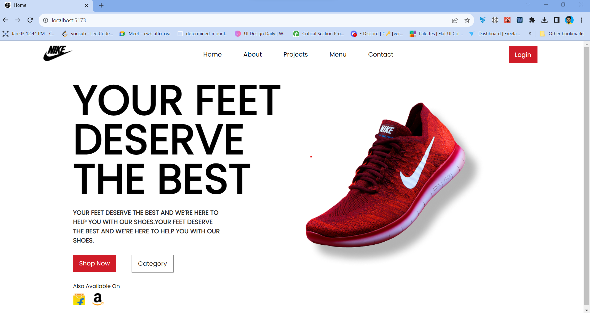

# React + Vite

This template provides a minimal setup to get React working in Vite with HMR and some ESLint rules.

Currently, two official plugins are available:

- [@vitejs/plugin-react](https://github.com/vitejs/vite-plugin-react/blob/main/packages/plugin-react/README.md) uses [Babel](https://babeljs.io/) for Fast Refresh
- [@vitejs/plugin-react-swc](https://github.com/vitejs/vite-plugin-react-swc) uses [SWC](https://swc.rs/) for Fast Refresh

<h1 align="center">Landing Page</h1>

<br />
<p align="center">
    
     
    
    
</p>

<h3 align="center"><a href=""><strong>Want to see live preview »</strong></a></h3>
  
 
  
  

## Getting Started

This project was built using HTML5, CSS3, JavaScript, React Js.

### Prerequisites

- NPM
- Node JS

## Install

Install NPM

Check that you have node and npm installed

To check if you have Node.js installed, run this command in your terminal:

```
node -v
```

To confirm that you have npm installed you can run this command in your terminal:

```
npm -v
```

To run the application open index.html in the live server.

### Tools used on this project

- Visual Studio Code

<br/>

## Follow me - **[Yousub Ali](https://github.com/YsbAli)**

## Show your support

Give a ⭐️ if you like this project!


## Contributing

Contributions are welcome! If you have ideas for new projects, improvements, or bug fixes, please check the [Contributing Guidelines](CONTRIBUTING.md).

## License

This repository is licensed under the [MIT License](LICENSE).

Feel free to explore, learn, and contribute to the world of React.js development!


